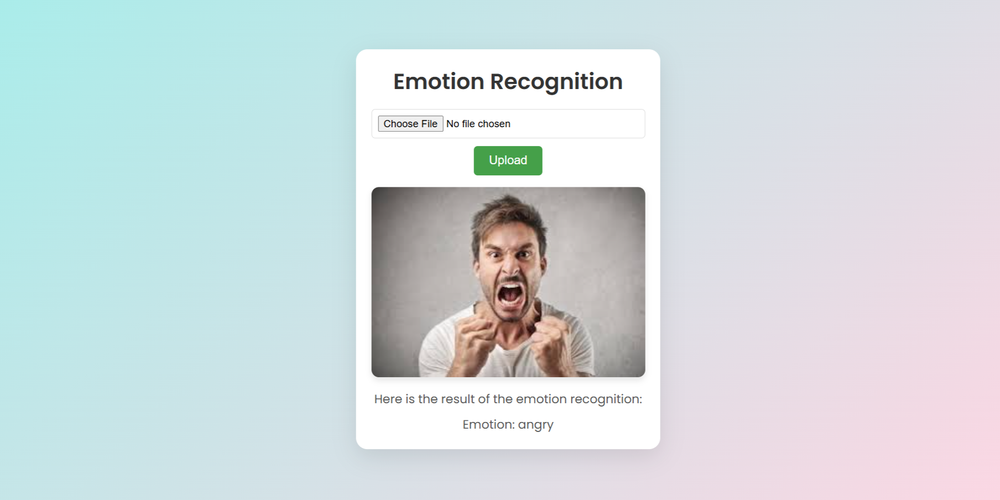

# Face Emotion Recognition Model

This repository contains a **Face Emotion Recognition Model** designed to detect human emotions from facial expressions. The model is trained using the **FER2013 dataset**, containerized using **Docker**, and deployed as a **web application** with **Flask**. 

It provides a simple web-based interface, allowing users to upload an image and receive predictions on the detected emotions in real-time.

---

## Table of Contents
- [Face Emotion Recognition Model](#face-emotion-recognition-model)
  - [Table of Contents](#table-of-contents)
  - [Features](#features)
  - [Dataset](#dataset)
  - [Project Structure](#project-structure)
  - [Installation](#installation)
    - [Usage](#usage)
  - [Docker Support](#docker-support)
  - [Training the Model](#training-the-model)
  - [How it Works](#how-it-works)
  - [Requirements](#requirements)
  - [License](#license)
  - [Sample Web App Interface](#sample-web-app-interface)

---

## Features
- Real-time emotion detection from facial images.
- Flask web app for easy interaction.
- Docker support for containerization.
- Jupyter Notebook with all training steps and results.
- Minimal dependencies using `requirements.txt`.

---

## Dataset

This model is trained on the **FER2013 dataset**. The dataset consists of **48x48 pixel grayscale images** of faces, with faces aligned to be centered and occupy a consistent portion of the image. The task is to predict the **emotion category** for each face.

- **Categories**:
  1. **Angry** (0)  
  2. **Disgust** (1)  
  3. **Fear** (2)  
  4. **Happy** (3)  
  5. **Sad** (4)  
  6. **Surprise** (5)  
  7. **Neutral** (6)  

- **Dataset Overview**:
  - **Training examples**: 28,709
  - **Public test examples**: 3,589

Here’s a sample of the grayscale face images used for training:

  
*Sample faces from the FER2013 dataset across different emotion categories.*

---

## Project Structure
```
├── models/              # Trained model weights and configurations
├── app/                 # Flask app files
│   ├── static/          # CSS, JS, and image assets
│   ├── templates/       # HTML templates for web interface
│   └── app.py           # Flask app entry point
├── notebooks/           # Jupyter notebook for training the model
│   └── training.ipynb   # Contains all training steps and details
├── requirements.txt     # Required Python packages
├── Dockerfile           # Docker configuration file
├── .dockerignore        # Docker ignore file
├── .gitignore           # Git ignore file
├── README.md            # Documentation (this file)
```

---

## Installation

To get started, clone this repository to your local machine:

```bash
git clone https://github.com/mostafaeslam/Face-Emotion-Recognition.git
cd Face-Emotion-Recognition
```

---

### Usage

1. **Install Dependencies**  
   Install the required packages using the `requirements.txt` file:

   ```bash
   pip install -r requirements.txt
   ```

2. **Run the Flask App**  
   Launch the web app on your **localhost** by executing:

   ```bash
   python app/app.py
   ```

3. **Access the Web App**  
   Open your browser and go to:

   ```
   http://127.0.0.1:5000
   ```

   From there, you can upload an image and view the emotion prediction results.

---

## Docker Support

You can also use Docker to containerize and run the app. Make sure you have **Docker** installed.

1. **Build the Docker Image**:

   ```bash
   docker build -t face-emotion-recognition .
   ```

2. **Run the Docker Container**:

   ```bash
   docker run -p 5000:5000 face-emotion-recognition
   ```

3. **Access the Web App**  
   Open your browser and visit:

   ```
   http://127.0.0.1:5000
   ```

---

## Training the Model

The repository includes a **Jupyter Notebook** (`notebooks/FER.ipynb`) that covers all the steps taken during the model's training phase. 

You can explore:
- Data preprocessing steps.
- Model architecture and hyperparameters.
- Training, validation, and testing results.

---

## How it Works

1. **Input**: The user uploads an image through the web interface.
2. **Processing**: The image is fed to the face emotion recognition model.
3. **Output**: The model predicts the emotion and displays the result on the webpage.

---

## Requirements

- Python 3.11
- Flask
- Docker (optional)
- Jupyter Notebook (optional for training)
- See `requirements.txt` for full list of dependencies.

---

## License

This project is licensed under the MIT License. See the `LICENSE` file for more details.

---

## Sample Web App Interface

Below is an example of the web interface you will see after running the app locally:

  
*Web interface example showing emotion prediction from a user-uploaded image.*